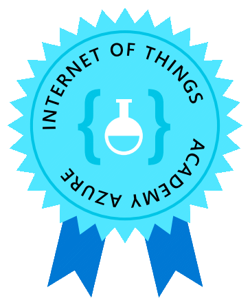

# :material-book-education: Education

- ## :material-school: College Degree

    | Item | Value |
    | --: | :-- |
    | School |  Portugal |
    | Course | Electrical Engineering, B.E. |
    | Branch | Industrial Automation |
    | Active | 2007 — 2015 |

- ## :material-message: Languages

    | Language | Proficiency |
    | --: | :-- |
    | Portuguese | **C2** Native |
    | English | **C1** Professional |

    ### :material-city-switch: Countries employed
    | Country | Duration |
    | --: | :-- |
    | Portugal | Native |
    | Germany | 2.5 mo |

- ## :material-certificate: Certifications

    | Topic | Badge | Course | Provider | Date |
    | --: | :-: | --- | --- | --- |
    | Cloud / Azure |  | [Microsoft Certified: Azure Fundamentals](https://www.credly.com/badges/3e77d235-bb78-443f-b73d-cc38de89d3d7) | Microsoft | Dec 30, 2022 |
    | Agile / Scrum |  | [Certified Scrum Developer ® — CSD](https://bcert.me/shxzksrtv) | Scrum Alliance | Sep 09, 2022 |
    | IoT |  | [Azure IoT Academy](assets/docs/education/cert-msft-azure_iot_academy-22.pdf) | Microsoft | Jun 30, 2022 |
    | Project Management |  | [Jira Fundamentals](https://university.atlassian.com/student/award/GbN6wQDpfPV3DfbzEH77hdEX) | Atlassian | Jun 24, 2022 |

